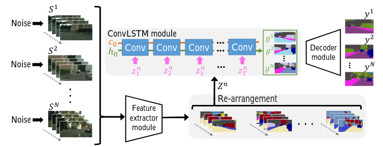

# Noisy-LSTM: Improving Temporal Awareness for Video Semantic Segmentation 
[PDF](https://arxiv.org/abs/2010.09466)

## Model Structure


## Abstract
Semantic video segmentation is a key challenge for various applications. This paper presents a new model named Noisy-LSTM, which is trainable in an end-to-end manner, with convolutional LSTMs (ConvLSTMs) to leverage the temporal coherency in video frames. We also present a simple yet effective training strategy, which replaces a frame in video sequence with noises. This strategy spoils the temporal coherency in video frames during training and thus makes the temporal links in ConvLSTMs unreliable, which may consequently improve feature extraction from video frames, as well as serve as a regularizer to avoid overfitting, without requiring extra data annotation or computational costs. Experimental results demonstrate that the proposed model can achieve state-of-the-art performances in both the CityScapes and EndoVis2018 datasets. 

## Usage

##### Data Set
Download from [Cityscapes](https://www.cityscapes-dataset.com/), set leftimg8bit and gitFine folder under your data_dir.
(For Noisy-LSTM training, leftImg8bit_sequence_trainvaltest data is necessary.)

##### Training for PSPNet (Base Model)
python train.py --model_name PSPNet --lstm False --noise False --data_dir

##### Training for PSPNet-based Nosiy-LSTM without noises
python train.py --model_name PSPNet --lstm True --use_pre True --noise False --data_dir

##### Training for PSPNet-based Nosiy-LSTM with noise
python train.py --model_name PSPNet --lstm True --use_pre True --noise False --noise_type extra --noise_ratio 50 --data_dir --data_extra

## Acknowledgements
This work was supported by Council for Science, Technology and Innovation (CSTI), cross-ministerial Strategic Innovation Promotion Program (SIP), Innovative AI Hospital System (Funding Agency: National Institute of Biomedical Innovation, Health and Nutrition (NIBIOHN)). This work was also supported by JSPS KAKENHI Grant Number 19K10662 and 20K23343.

## Publication
If you want to use this work, please consider citing the following paper.
```
@misc{wang2020noisylstm,
      title={Noisy-LSTM: Improving Temporal Awareness for Video Semantic Segmentation}, 
      author={Bowen Wang and Liangzhi Li and Yuta Nakashima and Ryo Kawasaki and Hajime Nagahara and Yasushi Yagi},
      year={2020},
      eprint={2010.09466},
      archivePrefix={arXiv},
      primaryClass={cs.CV}
}
```
